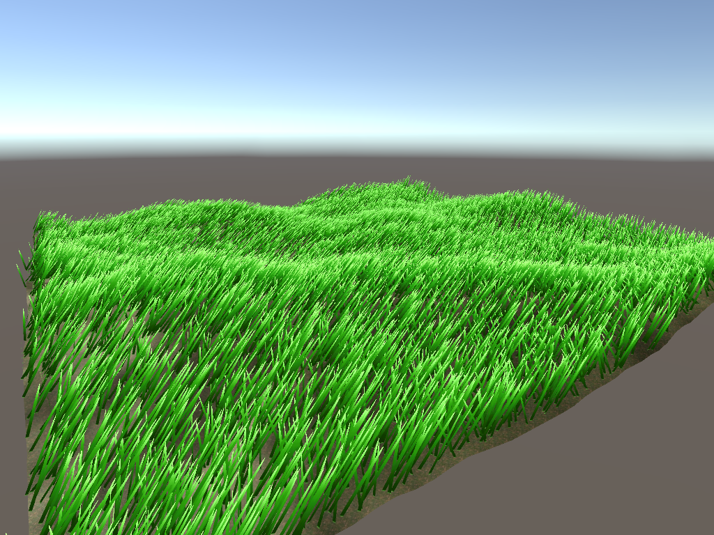

# Countless Grass

学习这两位大神的文章
- [使用Geometry Shader进行大片草地的实时渲染 流朔] https://zhuanlan.zhihu.com/p/119307479
- [利用GPU实现无尽草地的实时渲染 陈嘉栋] https://zhuanlan.zhihu.com/p/29632347

原理概述如下

1. 使用Geometry Shader生成草叶三角形
2. 用两个贴图（颜色+轮廓）渲染之
3. 生成地形mesh
4. 生成点云mesh（草根），用上述shader渲染
4. 添加随风摆动效果
5. 随机旋转让不同角度观察是不会有artifact
6. LOD支持动态修改草叶的顶点数目。

注：12800株草在电脑端的帧率对比，19的提升好明显啊啊啊

Unity5.4      82FPS      CPU main 11.9ms render thread 0.3ms
Unity2019.4   2955FPS    CPU main 0.3ms  render thread 0.2ms

